# System Architecture & Pipeline Design

## Overview

The AI-Powered Product Intelligence platform is an evidence-driven industrial product catalog transformation system. It ingests messy, inconsistent, multi-source industrial product data and converts it into structured, validated, standard-compliant commerce-ready intelligence.

```mermaid
flowchart LR
    A[Raw Supplier Data] --> B[Ingestion & Staging]
    B --> C[Identity Resolution]
    C --> D[Taxonomy Classification]
    D --> E[Knowledge & LOV Constraining]
    E --> F[LLM Attribute Enrichment]
    F --> G[Manufacturer Evidence Grounding]
    G --> H[Deterministic Validation]
    H -->|Pass| I[Commerce-Ready Catalog]
    H -->|Low Confidence / Conflict| J[Human Review Queue]
    J -->|Approved| I
    I --> K[Evaluation & Metrics Benchmark]
```

## Modular Backend Architecture (`apps/api/src/modules`)

Each module encapsulates a distinct stage of the product intelligence lifecycle:

| Module | Responsibility |
|---|---|
| **`ingestion`** | Ingests messy source feeds (CSV, JSON, Excel, scraped catalogs) and stages raw records preserving source fidelity. |
| **`products`** | Canonical product domain entity models, MPN/SKU normalization, and catalog repository. |
| **`taxonomy`** | Industrial category hierarchies (UNSPSC, ETIM, custom trees), path resolution, and multi-tier classification. |
| **`knowledge`** | Controlled reference data, Unilog master datasets, List of Values (LOV), and standard Units of Measure (UOM). |
| **`enrichment`** | LLM-driven structured attribute extraction, title normalization, and technical description generation. |
| **`evidence`** | Manufacturer datasheet retrieval, PDF text extraction, snippet grounding, and citation provenance. |
| **`validation`** | Deterministic business rules engine, schema compliance, regex checks, and boundary enforcement. |
| **`jobs`** | Asynchronous pipeline task orchestration, batch processing, and progress reporting. |
| **`review`** | Human-in-the-loop exception queue, conflict reconciliation, and auditor decision tracking. |
| **`evaluation`** | Precision, recall, extraction accuracy, and benchmark comparison against reference truth. |

## Core Invariants

1. **AI Proposes; Controlled Reference Data Constrains**: LLMs never write directly to final output without schema and LOV constraint checks.
2. **Manufacturer Evidence Grounding**: High-stakes technical values (voltages, tolerances, dimensions) must cite datasheet evidence.
3. **Traceability**: Raw inputs and normalization history are preserved alongside every generated field.
4. **Deterministic Validation**: Business rules and schema bounds are verified by code, not LLMs.
